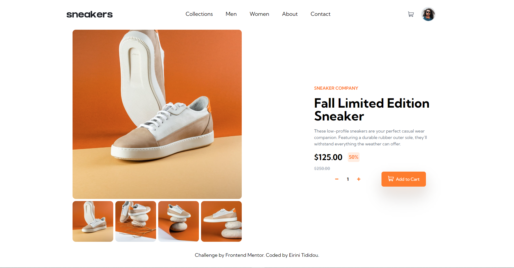

# Frontend Mentor - E-commerce product page solution

This is a solution to the [E-commerce product page challenge on Frontend Mentor](https://www.frontendmentor.io/challenges/ecommerce-product-page-UPsZ9MJp6). Frontend Mentor challenges help you improve your coding skills by building realistic projects.

## Table of contents

- [Overview](#overview)
  - [The challenge](#the-challenge)
  - [Screenshot](#screenshot)
  - [Links](#links)
- [My process](#my-process)
  - [Built with](#built-with)
  - [Continued development](#continued-development)
- [Author](#author)

## Overview

### The challenge

Users should be able to:

- View the optimal layout for the site depending on their device's screen size
- See hover states for all interactive elements on the page
- Open a lightbox gallery by clicking on the large product image (not completed)
- Switch the large product image by clicking on the small thumbnail images
- Add items to the cart
- View the cart and remove items from it (not completed)

### Screenshot

### Links

- Solution URL: [Add solution URL here](https://your-solution-url.com)
- Live Site URL: [Add live site URL here](https://your-live-site-url.com)

## My process

### Built with

- [React](https://reactjs.org/) - JS library
- [TailwindCSS](https://tailwindcss.com/) - CSS Framework
- Flexbox
- Mobile-first workflow

### Continued development

The key elements missing from the solution is the "photo gallery" and the "cart card". Both features will be added as I do more research in the most efficient way to implement them.

## Author

- Website - [Eirini Tipidou](https://github.com/Raven-Ir)
- Frontend Mentor - [@Raven-Ir](https://www.frontendmentor.io/profile/Raven-Ir)
